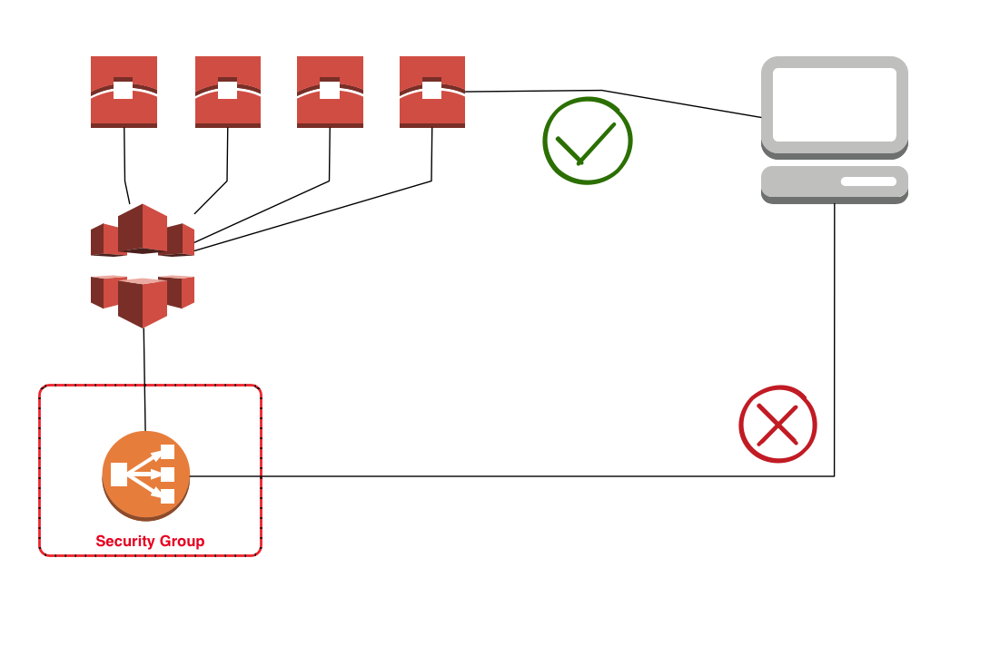

# AWS CloudFront security group updater
node.js version: cloudfront-sg-njs


## This project is not actively maintained anymore.


**AWS now seems to provide their own very similar lambda function, which also listens to an SNS topic 'AmazonIpSpaceChanged'.
I feel AWS can provide better support. [see this page on git](https://github.com/awslabs/aws-cloudfront-samples/tree/master/update_security_groups_lambda)

Additionally, it is now possible to add custom headers from Edge locations, allowing to pass a 'secret' and verify this in the backends: http://www.24hoursmedia.com/2016/01/23/protect-cloudfront-nginx/

The combination of these two techniques would be very effective.

**ot main


This script updates one or more security groups to allow access from Amazon's cloudfront IP ranges.

[view the product webpage](http://www.24hoursmedia.com/2015/10/08/aws-cloudfront-elb-securitygroup/)



It is possible to link cloudfront to an ELB or directly to your EC2 instances, so one can make of signed URL's and use CloudFront's caching capabilities and edge locations.

However, this leaves a security hole as the EC2 or ELB has to have a public Ip/Dns. This allows clients to bypass cloudfront and directly execute requests against your EC2 instances.

Creating a CloudFront security group that allows only CloudFront reduces this risk since your ELB or EC2 can only be accessed through cloudfront.

## Basic usage / examples

First, set up an empty security group, name is 'cloudfront80'. This security group will be filled with access rules to allow cloudfront access to port 80.

Then, make sure your AWS credentials has rights to modify and describe the security groups.

Execute the following command to update the security group with appropriate rules:

```
# run in (default) dryrun mode for debugging or getting insight. no actual changes are performed.
node cloudfront-sg.js sg-xxxxxxxx --region=aws-region-x --port 80

# actually update the security group. default is interactive mode,
# confirmation questions
# will be asked
node cloudfront-sg.js sg-xxxxxxxx --region=aws-region-x --port 80 --update

# force update without any confirmation questions
# (for use with crontab activation
node cloudfront-sg.js sg-xxxxxxxx --region=aws-region-x --port 80 --update --force

# update multiple security groups
# (for use with crontab activation
node cloudfront-sg.js sg-xxxxxxxx sg-yyyyyyyy --region=aws-region-x --port 80

# update two security groups, one to allow port 80 http access,
# and one to allow port 443 https access
node cloudfront-sg.js sg-xxxxxxxx sg-xxxxxxxx --region=aws-region-x --port 80
node cloudfront-sg.js sg-xxxxxxxx sg-yyyyyyyy --region=aws-region-x --port 80

# update one security group with both port 80 and port 443 access
# (NOT RECOMMENDED - a security group can have only 50 rules)
node cloudfront-sg.js sg-xxxxxxxx --region=aws-region-x --port 80 --port 443

```

### Sample output

```
# node cloudfront-sg.js sg-811cc2e5 --region=eu-west-1 --force

Update AWS security groups sg-811cc2e5 with cloudfront IP's for ports 80
Running in DRYRUN mode

loaded AWS Cloudfront IPs:54.182.0.0/16, 54.192.0.0/16, 54.230.0.0/16, 54.239.128.0/18, 54.239.192.0/19, 54.240.128.0/18, 204.246.164.0/22, 204.246.168.0/22, 204.246.174.0/23, 204.246.176.0/20, 205.251.192.0/19, 205.251.249.0/24, 205.251.250.0/23, 205.251.252.0/23, 205.251.254.0/24, 216.137.32.0/19
loaded description of security group sg-811cc2e5

updating security group sg-811cc2e5 with 16 ip ranges
adding 16 rules for security group sg-811cc2e5 for port 80
adding rule to security group: ALLOW TCP for port 80 to IP Range 204.246.164.0/22
adding rule to security group: ALLOW TCP for port 80 to IP Range 204.246.168.0/22
adding rule to security group: ALLOW TCP for port 80 to IP Range 204.246.174.0/23
adding rule to security group: ALLOW TCP for port 80 to IP Range 204.246.176.0/20
adding rule to security group: ALLOW TCP for port 80 to IP Range 205.251.192.0/19
adding rule to security group: ALLOW TCP for port 80 to IP Range 205.251.249.0/24
adding rule to security group: ALLOW TCP for port 80 to IP Range 205.251.250.0/23
adding rule to security group: ALLOW TCP for port 80 to IP Range 205.251.252.0/23
Adding 8 rules to security group sg-811cc2e5
skipped - dryrun mode; Request would have succeeded, but DryRun flag is set.

done.
```

### Passing custom credentials

If your default profile or IAM role does not allow making changes to the security group, you can use a custom access key and secret.
This is not recommended since the key and secret may be disclosed through the process list or command line history.

```
# use non-default access key and secret
node cloudfront-sg.js sg-xxxxxxxx --region=aws-region-x --accesskey=XXXXX  --secret=YYYYYY --port 80 --port 443
```

### Installation

Preconditions:

* node and npm installed

**using npm**

```
npm install node-aws-cloudfront-sg
```

**directly from git**

Pull the latest master branch from Git:
```
# pull repository from git
cd /opt/local
git clone https://github.com/24HOURSMEDIA/node-aws-cloudfront-sg
cd node-aws-cloudfront-sg
npm install
node cloudfront-sg.js
```


### Disclaimer and notes

This software is experimental and does not guarantee 100% security.

The command does NOT remove any present ingress rules from your security group.

One caveat is that your ELB or EC2 may still be accessed through other AWS user's CloudFront distributions.
This is less risk however, since these users are registered with AWS and under AWS's anti-abuse policies.

Updating the security groups is dependent upon Amazon's delivery of actual ip's in use.
These can be found at https://ip-ranges.amazonaws.com/ip-ranges.json.

When the above delivery is stopped, relocated, not timely updated, or modified otherwise in a backward-incompatible fashion, security group updating may fail. In that case requests may be incorrectly denied.
In that case, remove the security groups from your ELB's and/or EC2 instances, and take other measures.


*THE SOFTWARE IS PROVIDED "AS IS", WITHOUT WARRANTY OF ANY KIND, EXPRESS OR
 IMPLIED, INCLUDING BUT NOT LIMITED TO THE WARRANTIES OF MERCHANTABILITY,
 FITNESS FOR A PARTICULAR PURPOSE AND NONINFRINGEMENT. IN NO EVENT SHALL THE
 AUTHORS OR COPYRIGHT HOLDERS BE LIABLE FOR ANY CLAIM, DAMAGES OR OTHER
 LIABILITY, WHETHER IN AN ACTION OF CONTRACT, TORT OR OTHERWISE, ARISING FROM,
 OUT OF OR IN CONNECTION WITH THE SOFTWARE OR THE USE OR OTHER DEALINGS IN THE
 SOFTWARE.*


